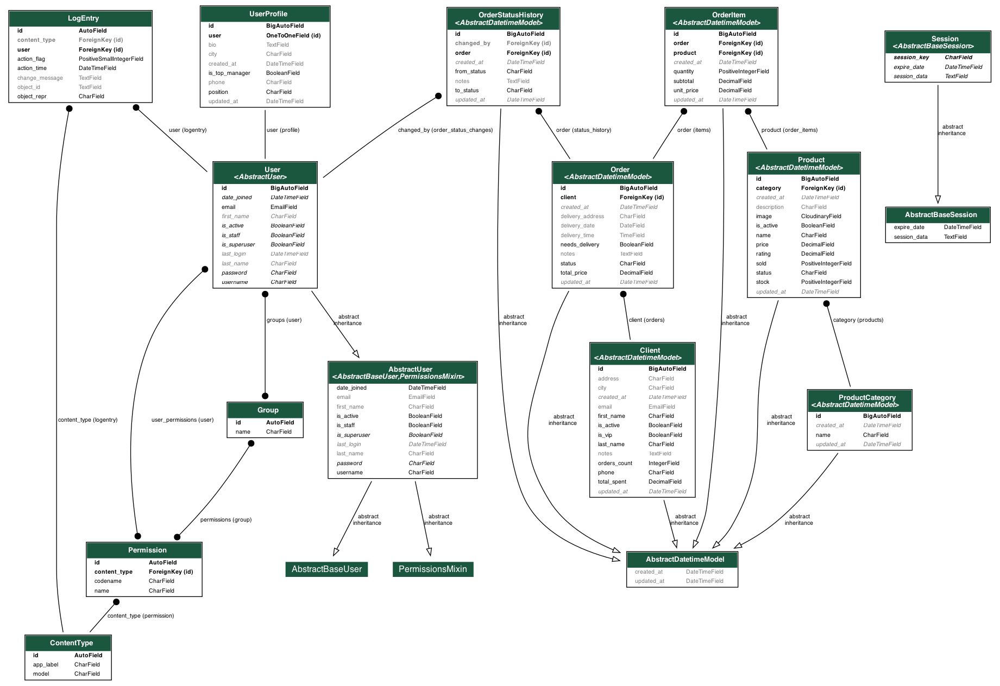

# CamelliaFlowers — CRM for Flower Business

CamelliaFlowers is a Django 6 web application for managing clients, products, and orders in a flower shop. The project supports authentication, order management (including status change history), analytics, and Cloudinary integration for product images.

## Requirements
- Python 3.13+
- PostgreSQL (for local production-like setup)

## Quick Start (Local)
1. Clone the repository and navigate to the project directory.
2. Create and activate a virtual environment.
3. Install dependencies:
   - Minimal required: `pip install -e .`
   - For development (with tests and linters): `pip install -e .[dev]`
4. Create `.env` in the project root (see existing file for example variables). Do not commit real secrets to the repository.
5. Apply migrations and run the server:
   ```bash
   python -m django migrate --settings=config.settings
   python -m django runserver --settings=config.settings
   ```

## Environment Configuration
- Production/local settings are loaded from `src/config/settings.py` and `.env`.
- For tests, a separate settings module `src/config/settings_test.py` is used (SQLite in-memory, fast password hashers, local email, stable Cloudinary config).

## Tests
We use `pytest` + `pytest-django` and collect coverage with `coverage`:

- Run all tests:
  ```bash
  pytest -q
  ```
- Detailed coverage report in terminal:
  ```bash
  pytest --cov=src --cov-report=term-missing
  ```

Configuration for `pytest` and `coverage` is in `pyproject.toml` (sections `tool.pytest.ini_options`, `tool.coverage.*`). Test files live in respective packages `src/apps/<app_name>/tests/`.

Detailed explanations about structure and test execution — see `TESTING.md` file.

## Pre-commit Hooks
The repository has `pre-commit` configured with hooks:
- Basic checks: `trailing-whitespace`, `end-of-file-fixer`, `check-merge-conflict`, `check-yaml`.
- Lint/format: `ruff` (auto-fixes) and `ruff-format`.

Installation:
```bash
pip install -e .[dev]
pre-commit install
```
Manual run on entire repository:
```bash
pre-commit run --all-files
```

## Database Schema



The database consists of the following main components:

### Core Apps
- **accounts** — Custom user model (email-based login) and profiles
- **clients** — Client management, counters, VIP logic
- **products** — Products, categories, state machine, Cloudinary images
- **orders** — Orders, order items, status history, AJAX endpoints

## Security
- Do not commit real secrets to the repository. For local development use `.env` with local values.
- Tests are configured with safe Cloudinary values and SQLite in-memory database.

## License
MIT